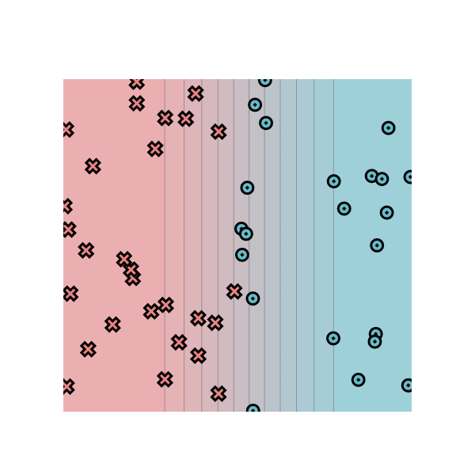
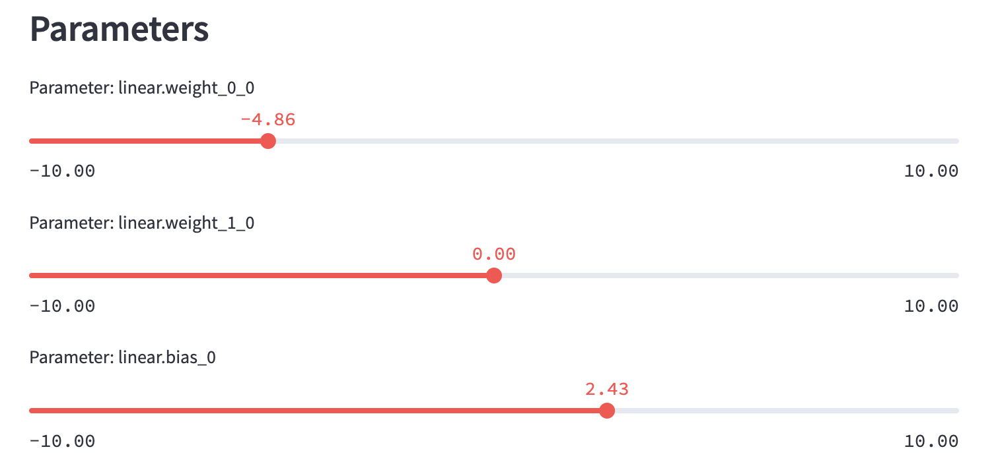

# MiniTorch Module 0

* Docs: https://minitorch.github.io/

* Overview: https://minitorch.github.io/module0.html

## [Module 0.5]

### Please see find the visualization in Module 0.5  below:

### Here are the parameters that were selected through manual trial and error:

