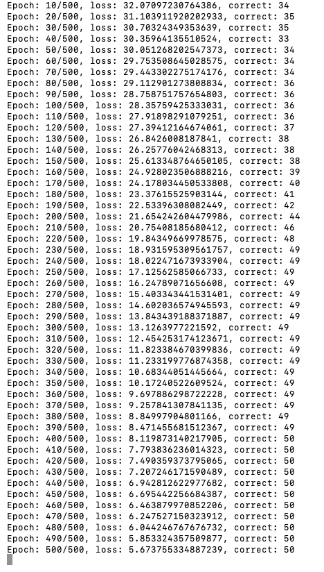

[](https://classroom.github.com/online_ide?assignment_repo_id=8875020&assignment_repo_type=AssignmentRepo)
# MiniTorch Module 2


* Docs: https://minitorch.github.io/

* Overview: https://minitorch.github.io/module2/module2/

This assignment requires the following files from the previous assignments. You can get these by running

```bash
python sync_previous_module.py previous-module-dir current-module-dir
```

The files that will be synced are:

        minitorch/operators.py minitorch/module.py minitorch/autodiff.py minitorch/scalar.py minitorch/module.py project/run_manual.py project/run_scalar.py


## [Module 2.5]

### Please see find the visualization parameters and output for the simple dataset in Module 2.5  below:


### Please see find the visualization parameters and output for the diag dataset in Module 2.5  below:


### Please see find the visualization parameters and output for the split dataset in Module 2.5  below:





### Please see find the visualization parameters and output for the xor dataset in Module 2.5  below:


